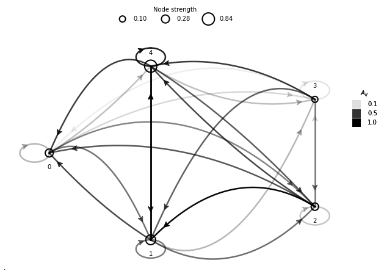
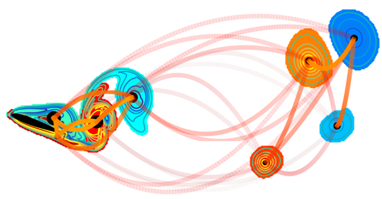
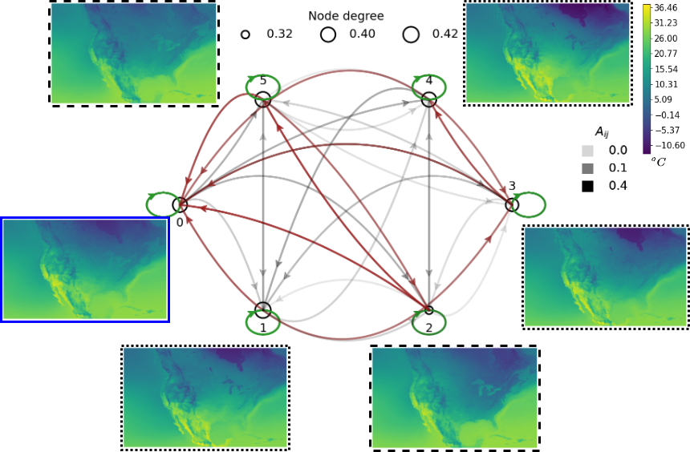

# graphviz-parabolic

Visualizing graphs with edges plotted as parabolic lines.

Author: Muralikrishnan Gopalakrishnan Meena (Oak Ridge National Laboratory), https://sites.google.com/view/muraligm/

# Run

* For Python version (best version as is now): Run [plotgraph_parabola.ipynb](https://github.com/muralikrishnangm/graphviz-parabolic/blob/main/plotgraph_parabola.ipynb) Or 
* For Matlab version: Run [test_matlab.m](https://github.com/muralikrishnangm/graphviz-parabolic/blob/main/test_matlab.m)

# Sample outputs

A sample of the expected output from the Python version [plotgraph_parabola.ipynb](plotgraph_parabola.ipynb).

An image generated using the codes shows the interactions amongst vortical structures in the wake of an airfoil. Reference: https://doi.org/10.1103/PhysRevE.97.063103

