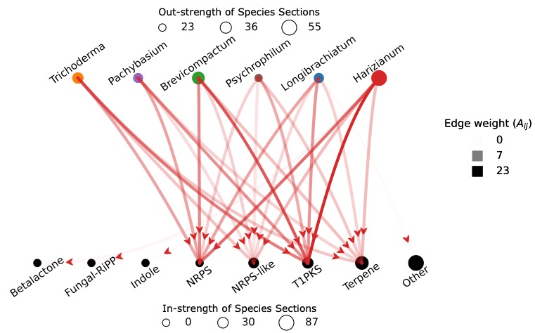

# graphviz-parabolic

Visualizing graphs with edges plotted as parabolic lines.

Author: Muralikrishnan Gopalakrishnan Meena (Oak Ridge National Laboratory), https://sites.google.com/view/muraligm/

# Run

* For Python version (best version as is now): Run [plotgraph_parabola.ipynb](plotgraph_parabola.ipynb) Or 
* For Matlab version: Run [test_matlab.m](test_matlab.m)

# Sample outputs

**Figure 1**: An expected output from the Python version [plotgraph_parabola.ipynb](plotgraph_parabola.ipynb).

***

**Figure 2**: An image generated using the codes showing the interactions amongst vortical structures in the wake of an airfoil. Reference: https://doi.org/10.1103/PhysRevE.97.063103

***

**Figure 3**: A bipartite network showing the influence of various species of *Trichoderma* fungus with enzymes. Reference: https://doi.org/10.3389/ffunb.2021.716511

***

**Figure 4**: A network showing the interactions amongst surface temperature climate modes.

